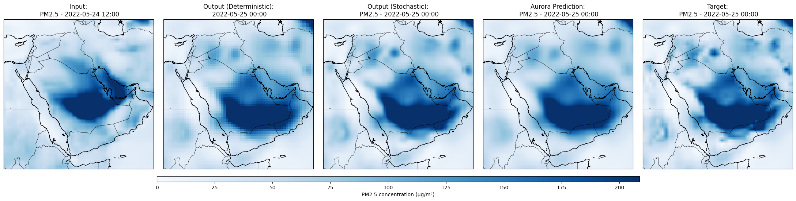

# Synergistic-Neural-Forecasting-of-Air-Pollution-with-Stochastic-Sampling


# SynCast

This repository gives the official implementation of Synergistic Neural Forecasting of Air Pollution
with Stochastic Sampling




## Abstract
>Air pollution remains a leading global health and environmental risk, particularly in regions vulnerable to episodic air pollution spikes due to wildfires, urban haze and dust storms. Accurate forecasting of particulate matter (PM) concentrations is essential to enable timely public health warnings and interventions, yet existing models often underestimate rare but hazardous pollution events. Here, we present SynCast, a high-resolution neural forecasting model that integrates meteorological and air composition data to improve predictions of both average and extreme pollution levels. Built on a regionally adapted transformer backbone and enhanced with a diffusion-based stochastic refinement module, SynCast captures the nonlinear dynamics driving PM spikes more accurately than existing approaches. Leveraging on harmonized ERA5 and CAMS datasets, our model shows substantial gains in forecasting fidelity across multiple PM variables PM<sub>1</sub>, PM<sub>2.5</sub>, PM<sub>10</sub>, especially under extreme conditions. We demonstrate that conventional loss functions underrepresent distributional tails (rare pollution events) and show that SynCast, guided by domain-aware objectives and extreme value theory, significantly enhances performance in highly impacted regions without compromising global accuracy.  This approach provides a scalable foundation for next-generation air quality early warning systems and supports climate–health risk mitigation in vulnerable regions.


## News
- *2025-10-27* Release the code


## Requirements
A suitable [conda](https://conda.io/) environment named `SynCast` can be created
and activated with:

```
conda create -n "SynCast" python=3.10.13 -y
conda activate SynCast
sh setup.sh
```


<!-- ## Pretrained model

Download our trained model [here](). -->


<!-- ## Demo
 -->


<!-- ## Testing
 -->


<!-- ## Training -->


<!-- ### Data preparing -->


<!-- ## Citing Us
If you find our work valuable, we kindly ask you to consider citing our paper and starring ⭐ our repository.


```
``` -->

## Acknowledgements

This code borrows heavily from [Pangu](https://github.com/198808xc/Pangu-Weather/tree/main) and [ExtreamCast](https://github.com/black-yt/ExtremeCast).

## Maintenance

Please open a GitHub issue for any help. If you have any questions regarding the technical details, feel free to contact us. 

<!-- ## License

This project is licensed under the MIT License. See LICENSE.txt for the full MIT license text. -->

